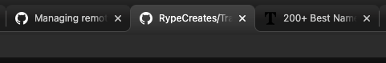

# [Track Tab](./index.md): Tab Highlighting

## Overview

Currently, a chrome user intuitively knows the active tab in the browser because the Chrome UI brings that tab to the forefront and gives it a slightly different shade of color. 

There is no way of knowing by default, however, which of the two adjacent tabs to the current is the more recently viewed tab in the user's browsing experience.

We can add a highlighting feature that slightly alters the color of the most recently viewed tab (aside from the current tab). This way if a user has several tabs open, the user can see at a glance which tab they were just on before navigating to their currently viewed tab.  